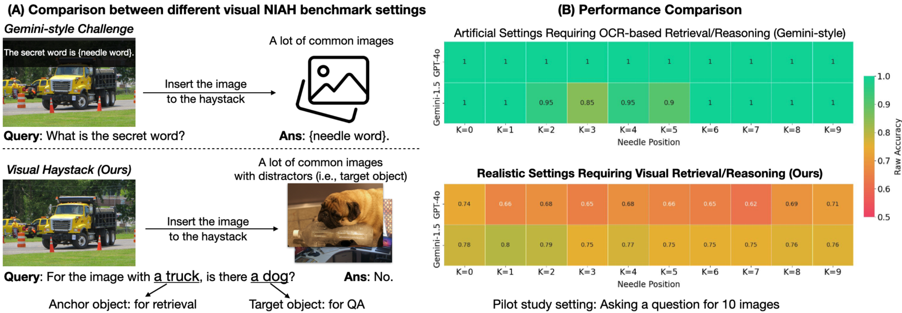
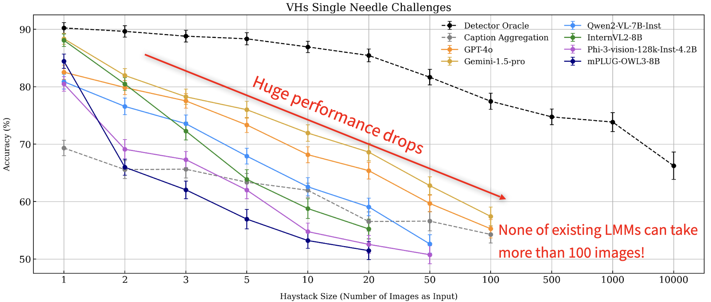
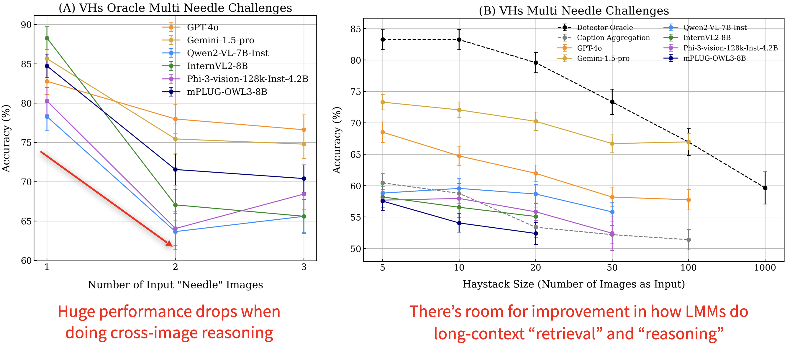
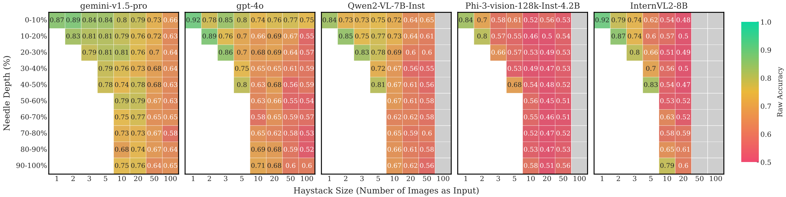

# Visual Haystacks: A Vision-Centric Needle-In-A-Haystack Benchmark

[](https://www.python.org/downloads/release/python-310/)
[](https://github.com/ambv/black)
[](https://lbesson.mit-license.org/)  [](https://arxiv.org/abs/2407.13766) 

This repo provides the benchmark toolkit of our proposed Visual Haystacks (VHs) dataset: [Visual Haystacks: A Vision-Centric Needle-In-A-Haystack Benchmark](https://arxiv.org/abs/2407.13766). Check out project page [here](https://visual-haystacks.github.io/)!

**Authors**: [Tsung-Han Wu](https://tsunghan-wu.github.io/), [Giscard Biamby](https://scholar.google.com/citations?user=s0Fof5IAAAAJ&hl=en), [Jerome Quenum](https://people.eecs.berkeley.edu/~jquenum/), [Ritwik Gupta](https://ritwikgupta.me/), [Joseph E. Gonzalez](https://people.eecs.berkeley.edu/~jegonzal/), [Trevor Darrell](https://people.eecs.berkeley.edu/~trevor/), [David M. Chan](https://dchan.cc/) at UC Berkeley. 

**Visual Haystacks (VHs) Benchmark Dataset**: [🤗 tsunghanwu/visual_haystacks](https://huggingface.co/datasets/tsunghanwu/visual_haystacks)

**Our Multi-Image Retrieval Augmented Generation (MIRAGE) Model**: [🤗tsunghanwu/mirage-llama3.1-8.3B](https://huggingface.co/tsunghanwu/mirage-llama3.1-8.3B), [🐙 Github Repo](https://github.com/visual-haystacks/mirage)

## :crystal_ball: What is Visual Haystacks and Why?

Visual Haystacks (VHs) is a vision-centric Needle-In-A-Haystack (NIAH) benchmark designed to evaluate the capabilities of Large Multimodal Models (LMMs) in visual retrieval and reasoning tasks involving diverse and unrelated image sets. Conventional visual NIAH challenges often depend on artificial and OCR-centric scenarios, such as copy-and-paste or out-of-domain image patches, or the overlay of transcripts. These setups frequently yield near-perfect performance, providing limited insights into the practical effectiveness of models. In contrast, the VHs benchmark is carefully curated to ensure a realistic, reliable, and vision-focused evaluation. It challenges both open-source and proprietary long-context LMMs (including GPT-4o and Gemini 1.5 Pro), even with in-domain images and seemingly simple questions.

VHs consists of 1K binary visual question-answer pairs for sets containing differeing numbers images, with each set ranging from 1 to 10K images. Each question is about the presence of an object in some relevant images: the model needs to first retrieve these needle images in a haystack of data and then answer the corresponding question. The dataset is carefully curated to ensure that guessing or relying on common sense reasoning without viewing the image results in a 50% accuracy rate. The dataset is derived from the COCO dataset and includes two types of challenges: the single-needle challenge and the multi-needle challenge.

-   **Single-Needle Challenge**: Only a single needle image exists in the haystack of images. The question is framed as, "For the image with the anchor object, is there a target object?"
-   **Multi-Needle Challenge**: Two or three needle images exist in the haystack of images. The question is framed as either, "For all images with the anchor object, do all of them contain the target object?" or "For all images with the anchor object, do any of them contain the target object?"


## :rocket: Interesting Applications/Findings

0. **Context Limitations**: Current LMMs cannot process more than 100 images due to API rejections (payload exceeding limits), context length overflows, or memory constraints on 4 A100 GPUs.

1. **Susceptibility to Visual Distractors**: While LMMs can perform nearly as well as specialized detectors on single-image tasks, their effectiveness decreases significantly as the number of images increases.


2. **Challenges in Cross-Image Reasoning**: LMMs experience substantial performance declines when required to integrate information across multiple key images; reintroducing noisy images exacerbates this decline even further.


3. **Positional Biases**: LMMs exhibit various positional biases—information placed at different positions within the context window yields different results. For instance, GPT-4 exhibits a ["lost-in-the-middle"](https://arxiv.org/abs/2307.03172) phenomenon in the visual domain, Gemini 1.5 Pro shows a preference for images at the beginning, and open-source models often favor the last image when given a small set.


In light of these observations, we introduce MIRAGE-8.3B, a pioneering open-source visual-RAG solution capable of handling up to 10,000 image inputs and somewhat mitigating the above challenges. We will to release the code and checkpoint by October 21, 2024!

## :rotating_light: Status Updates

### Recent Activities:
- **10/18/2024:** We've published our MIRAGE codebase. Check it out [here](https://github.com/visual-haystacks/mirage).
- **10/14/2024:** We've updated our datasets to enhance diversity and balance. In this version, we include GPT-4o, Gemini 1.5 Pro, Claude 3.5 Sonnet, LLaVA-Next, Qwen2-VL-7B-Instruct, Idefics-3, InternVL2-8B, Phi3-vision, mPLUG-OWL3, and LongViLA.
- **07/18/2024:** Scripts were released for running inference using various models on the Visual Haystacks (VHs) benchmark, including GPT-4, Gemini, Claude, LLaVA, QwenVL, Idefics2, and others.

We invite collaborators working on multi-image reasoning to reach out for integrating their latest models into our repository!

## :wrench: Development Kits

### Preparation

1. **Package Installation**

```sh
# Create conda environment
conda create --name vhs python=3.10
conda activate vhs
# Install packages and then flash-attn separately
pip3 install -r requirements.txt
pip3 install flash-attn --no-build-isolation --no-cache-dir
```

* Note: [Idefics-3](https://huggingface.co/HuggingFaceM4/Idefics3-8B-Llama3) and [LongViLA](https://github.com/NVlabs/VILA) requires additional installation steps. Please refer to their official instructions.

2. **Data Preparation**
  - Download the VQA questions from [🤗 tsunghanwu/visual_haystacks](https://huggingface.co/datasets/tsunghanwu/visual_haystacks). Our data structure is similar to LLaVA's one, which is easy to play with.
    ```
    huggingface-cli download --repo-type dataset tsunghanwu/visual_haystacks --local-dir dataset/VHs_qa
    ```
  - Download the COCO 2017 dataset and organize it as follows, with the default root directory `./dataset/coco`:
    ```
    dataset/
    ├── coco
    │   ├── annotations
    │   ├── test2017
    │   └── val2017
    └── VHs_qa
        ├── VHs_full
        │   ├── multi_needle
        │   └── single_needle
        └── VHs_small
            ├── multi_needle
            └── single_needle
    ```

### Execution

Run the script:

```sh
python3 main.py
```

Note:

-   Add your OpenAI and Google API key to `conf/solver/*.yaml`.
-   This all-in-one script will run inference and then go through evaluation.
-   Modify configs in `conf/` if needed. Please refer to [hydra's document](https://hydra.cc/) for more information if required as we use this tool in the project.

### Explanations on the config

```
defaults:
  - solver: llava # which solve we're gonna use
  - _self_

basic:
  debug_mode: False     # debug mode or not (use only single instsace to prevent spending $$$)
  mode: single_needle   # single_needle/multi_needle
  image_root: dataset   # dataset root directory
  test_file_base: dataset/VHs_qa/single_needle/VHs_large   # all json files are put in this directory
  output_dir: output/${solver.name}_${basic.mode}/result  # output result directory (saving jsons)
  image_counts: ["oracle", 2, 3]    # we will read the json file named as "visual_haystack_{entry}.json"

hydra:
  run:
    dir: output/${solver.name}_${basic.mode}/logs   # log dir
```

## :dart: Citation

If you use our work or our implementation in this repo, or find them helpful, please consider giving a citation.
```
@article{wu2024visual,
  title={Visual Haystacks: A Vision-Centric Needle-In-A-Haystack Benchmark},
  author={Wu, Tsung-Han and Biamby, Giscard and and Quenum, Jerome and Gupta, Ritwik and Gonzalez, Joseph E and Darrell, Trevor and Chan, David M},
  journal={arXiv preprint arXiv:2407.13766},
  year={2024}
}
```